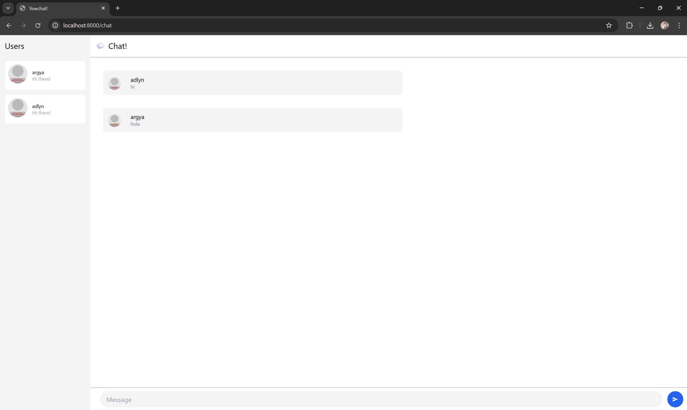
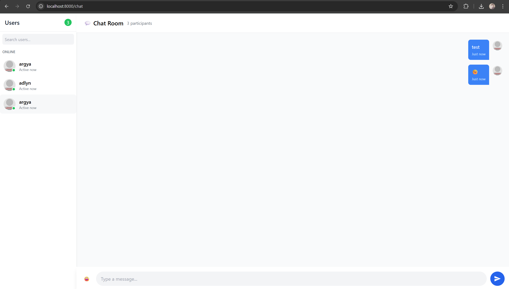

# Module 10 - Yew Chat

## 3.1 Original code

Here is the original view of the code running. Here there are 2 users who have each sent a message.

## 3.2 Add some creativities to the webclient

# Chat Application UI/UX Improvements

I've enhanced my Yew chat application with focused UI/UX improvements:

## Cleaner Visual Design
- Distinct message bubbles: blue/right-aligned for my messages, gray/left-aligned for others
- User status indicators showing who's online/offline
- Improved spacing, shadows, and visual hierarchy throughout

## Better User Experience
- Send messages with Enter key for faster communication
- Auto-scroll to new messages when they arrive
- Clear focus states on interactive elements
- Loading placeholders for images and GIFs

## New Features
- Simple emoji picker for more expressive messaging
- User search box for navigating larger chat rooms
- Grouped users by online/offline status
- Message timestamps for better conversation context

These changes transform the application into a more polished, intuitive chat experience while maintaining my existing functionality and component structure.